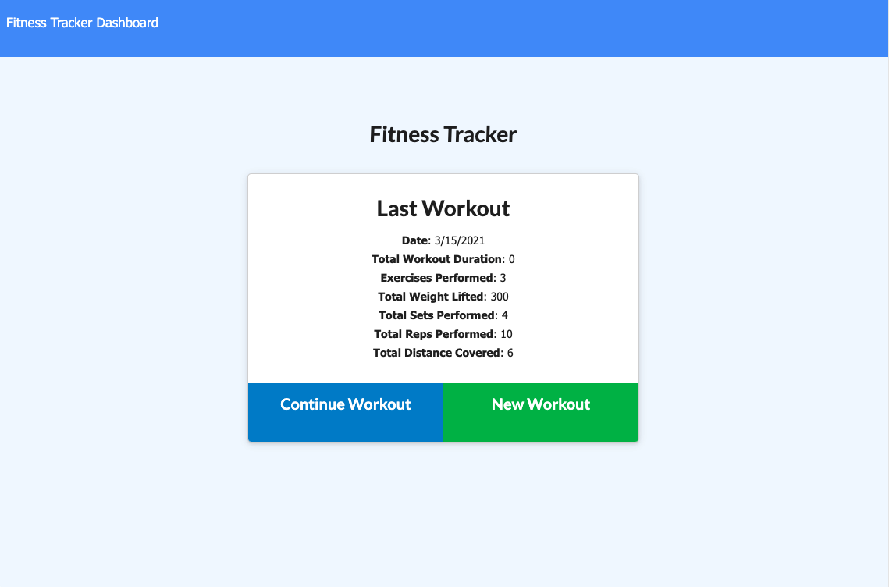
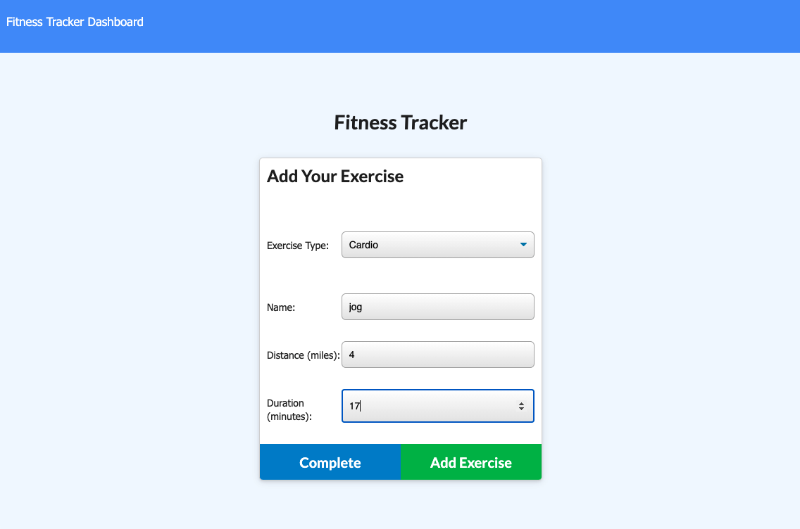
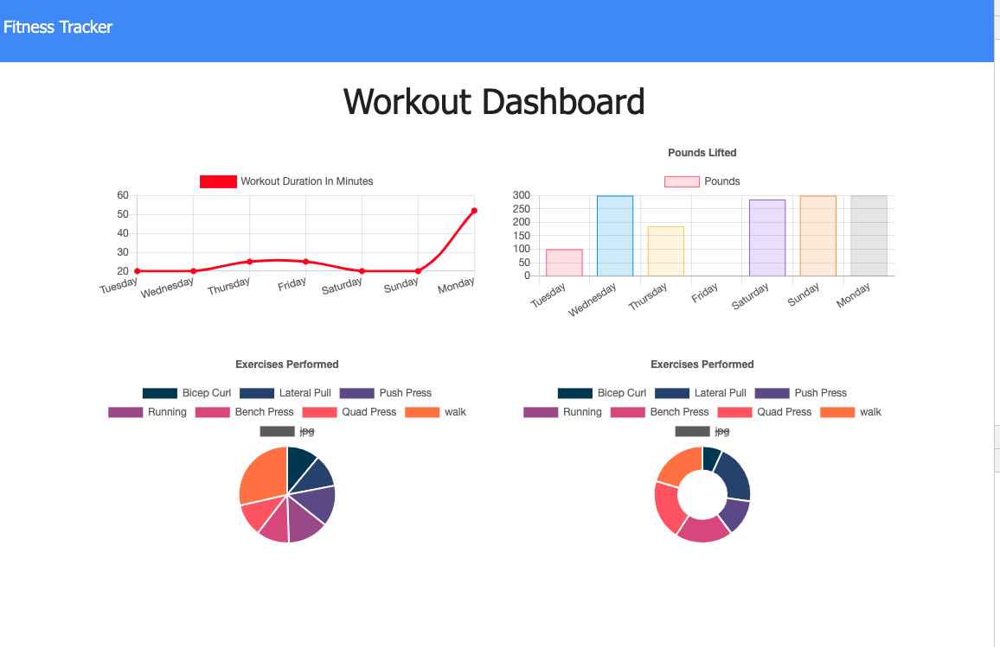

# WorkoutTracker

 # Unit 17 NoSQL Homework: Workout Tracker
  

  # **Description**
  * For this assignment,I created a workout tracker. I was provided with the front end code in the `Develop` folder. This assignment I created a Mongo database with a Mongoose schema and handle routes with Express.

    

  # ** Table of Contents**
  1. [Description](#Description)
  2. [Screenshots](#Screenshots)
  3. [Dependencies](#Dependencies)
  4. [Application](#Application)
  5. [Contributors](#Contributors)
  6. [FAQ](#FAQ)
  
  
  
  

  # **Screenshots**
   
  

  
  
  

 
  # **Dependencies**
  List of required installations prior to download if you would like to work with code from portfolio projects.

  Install the following:

   * npm init

  Run Application:
   * node server.js

  Varying between the applications, I install the following packages:

    * npm install express
    * npm install mongoose
    * npm install morgan
  

 Requirements:
   * Install latest version of Mongo and Robo 3T

  
  
  # **Application**
  
  * Link to Application:
  * Github Repo: https://github.com/Franciscorosado09/WorkoutTracker
  
  # **Contributors**
  Author of README Francisco E. Rosado

  *  GW for Starter code
  * Additionsl sources: 
        * https://docs.mongodb.com/manual/reference/operator/aggregation/addFields/
        * https://docs.mongodb.com/manual/reference/operator/aggregation/sum/
        * https://mongoosejs.com/docs/api.html#aggregate_Aggregate

  * Feedback, brainstorming, and general support to study group:

        1. Young Ji Kim - https://github.com/youjmi
        2. Amir Ashtiany - https://github.com/Alexfit4
        3. Johnnie Simpson - https://github.com/balokdecoy
        4. Rachel Wanke - https://github.com/rwanke14
    
  
  # **FAQ**
  Contact info:

    * README Author: Francisco E. Rosado

    * Email: Franciscorosado09@gmail.com

    * Github Repo ID: Franciscorosado09

  
  
  